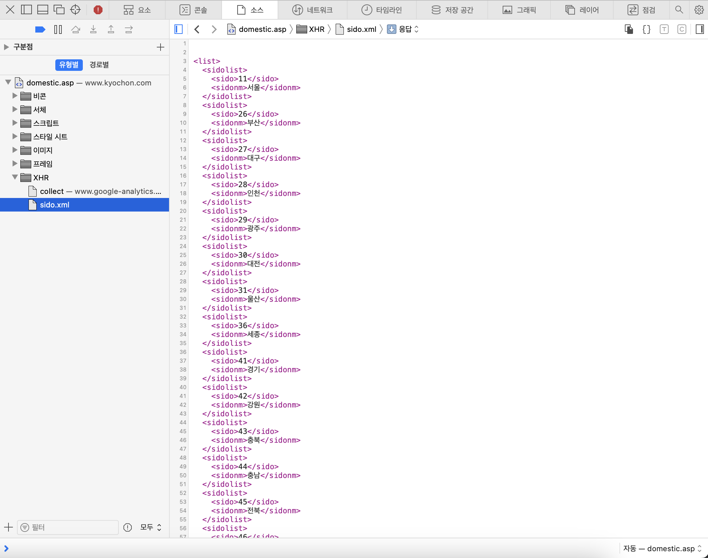
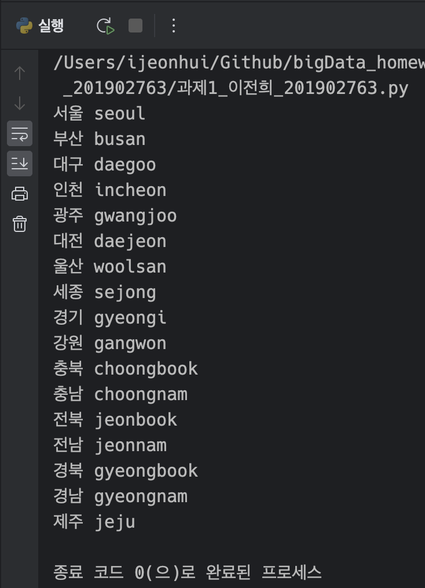
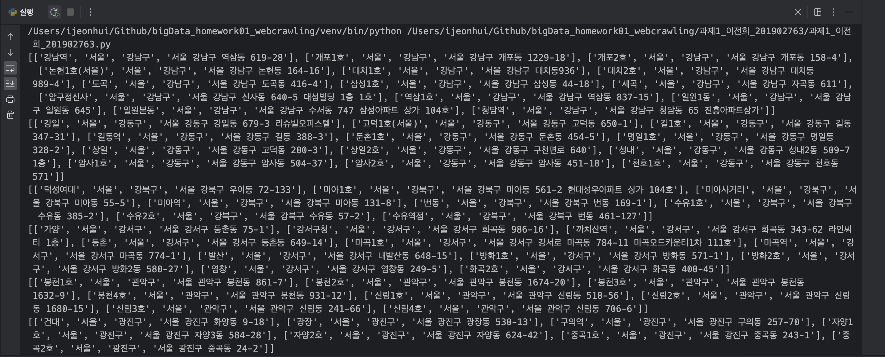
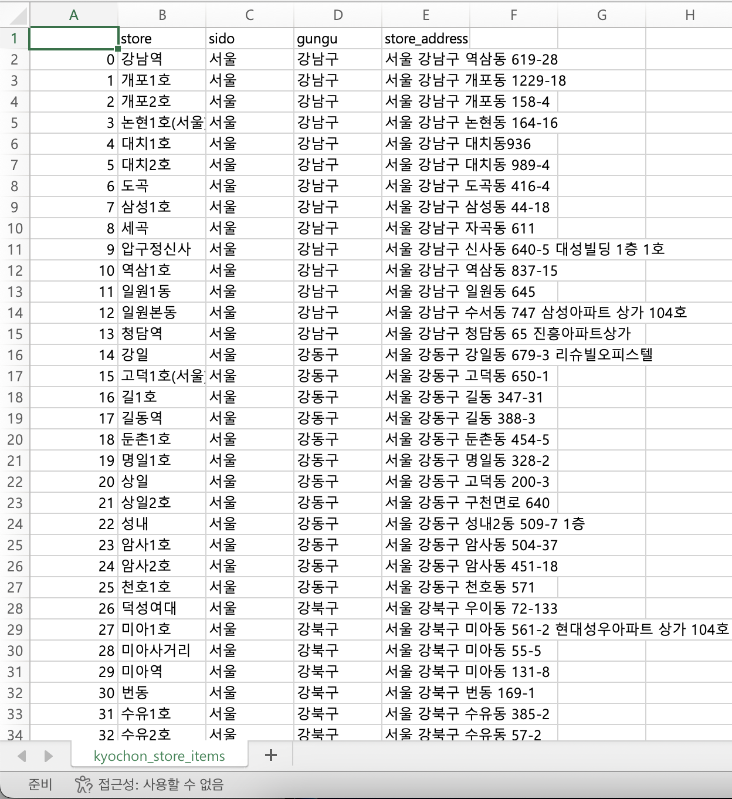

# 과제1. 웹 크롤링

---

**과목: 빅데이터 처리**

**담당 교수: 장익범**

**학번: 201902763**

**이름: 이전희**

---

## 주제

파이썬을 이용한 교촌치킨 매장 정보 크롤링

## 라이브러리

`BeautifulSoup`, `urllib`, `pandas`, `ssl`

## 과정

1. openUrl함수에서 시/도 데이터를 불러오기 전에 html데이터를 불러오기 때문에 
    
    url을 통해 직접적으로 sido.xml파일을 접근하여 시/도 xml 데이터를 불러옴.
    
    
    
2. 위 시/도 데이터를 통해 같은 과정으로 군/구 데이터를 가져옴.

    위 과정에서 한글로 된 지역명을 가져오기 때문에 한글 지역명을 영어로 바꿔주는 함수(`translateLocation`) 이용
   
    
3. 해당 시/도, 군/구 데이터를 가지고, 각각에 인덱스 번호를 부여하여 해당 교촌 지역의 매장 검색 결과를 parsing하여 가져옴.  
4. 위에서 얻은 데이터를 `[가맹점 이름, 시/도, 군/구, 주소]` 형식으로 변경 뒤, 결과들을 결합
    
    
5. pandas 라이브러리의 DataFrame을 이용하여, 결과를 `kyochon_store_items.csv` 파일로 저장
    
    
    

## 함수

```python
def kyochonUrl(sido1=0, sido2=0, txt=""):
    """
    교촌 시/도별 가맹점 검색 url
    :param sido1: 시/도 번호 (int)
    :param sido2: 군/구 번호 (int)
    :param txt: 검색 키워드 (string)
    :return: 교촌 시/도별 가맹점 검색 url (string)
    """
```

```python
def kyochonLocationDataUrl(sido="sido"):
    """
    교촌 시/도 데이터 파일 url
    :param sido: 지역 이름 - 영문 (string)
    :return: 교촌 시/도 데이터 파일 url (string)
    """
```

```python
def translateLocation(location):
    """
    지역 이름 번역
    :param location: 지역 이름 - 한글 (string)
    :return: 지역 이름 - 영문 (string)
    """
```

```python
def xmlDataParsing(url, tag):
    """
    xml의 data를 parsing
    :param url: 사이트의 url (string)
    :param tag: parsing 할 tag (string)
    :return: parsing한 데이터의 텍스트 (list(string))
    """
```

```python
def htmlParsing(url, tag, attrs={}, children=[]):
    """
    html의 data를 parsing
    :param url: 사이트의 url (string)
    :param tag: parsing 할 tag (string)
    :param attrs: parsing 할 tag의 속성 값 (dict(string: string))
    :param children: parsing 할 tag의 자식의 tag (list(string))
    :return: children 값을 주었을 때, [{자식1의 태그명: 자식1의 텍스트, ...}, ...] (list(dict(string:string)))
             children 값을 주지 않았을 때, [{태그명: 텍스트}, ...] (list(dict(string:string)))
    """
```